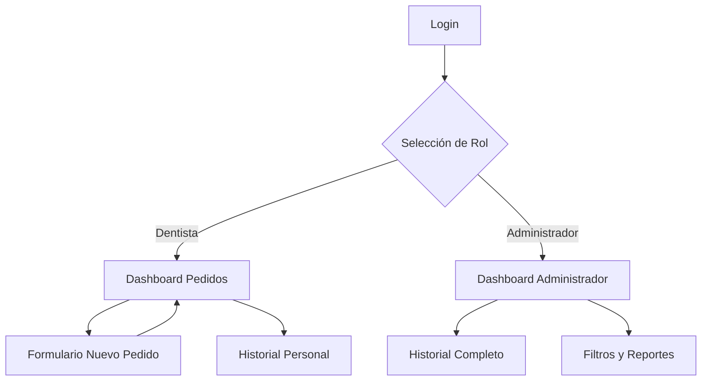

## 1. Product Overview
Sistema de gestión de pedidos de prótesis dentales para clínicas dentales. Permite a dentistas crear pedidos de prótesis y a administradores visualizar y gestionar el historial de pedidos.

Esta prueba de concepto demuestra el flujo básico de creación y visualización de pedidos sin necesidad de base de datos, ideal para validar la viabilidad del sistema antes de una implementación completa.

## 2. Core Features

### 2.1 User Roles
| Role | Registration Method | Core Permissions |
|------|---------------------|------------------|
| Dentista | Login mock (usuario: dentista / contraseña: demo123) | Crear nuevos pedidos de prótesis, ver sus propios pedidos |
| Administrador | Login mock (usuario: admin / contraseña: admin123) | Ver todos los pedidos, acceder al historial completo, filtrar por estado |

### 2.2 Feature Module
El sistema de pedidos de prótesis dentales consta de las siguientes páginas principales:
1. **Página de Login**: Formulario de autenticación, selección de tipo de usuario.
2. **Dashboard de Pedidos**: Lista de pedidos activos, filtros por estado, botón de nuevo pedido.
3. **Formulario de Pedido**: Campos para tipo de prótesis, especificaciones, datos del paciente, fecha de entrega.
4. **Historial de Pedidos**: Vista completa de todos los pedidos con búsqueda y filtros avanzados.

### 2.3 Page Details
| Page Name | Module Name | Feature description |
|-----------|-------------|---------------------|
| Login | Formulario de autenticación | Ingresar usuario y contraseña, seleccionar rol (dentista/admin), validación de credenciales mock, redirección según rol |
| Dashboard de Pedidos | Lista de pedidos activos | Mostrar pedidos pendientes y en proceso, indicador visual de estado, botón "Nuevo Pedido", filtro rápido por estado |
| Dashboard de Pedidos | Barra de acciones | Búsqueda por nombre de paciente, filtro por fecha, botón de actualización |
| Formulario de Pedido | Datos del paciente | Campo nombre completo, selector de tipo de prótesis (corona, puente, dentadura), campo de especificaciones adicionales |
| Formulario de Pedido | Detalles del pedido | Selector de material (cerámica, metal, resina), campo fecha estimada de entrega, campo notas adicionales, botón guardar |
| Historial de Pedidos | Tabla de pedidos | Mostrar todos los pedidos con columnas: paciente, tipo, material, estado, fecha, acciones de visualización |
| Historial de Pedidos | Filtros avanzados | Búsqueda por paciente, filtro por rango de fechas, filtro por tipo de prótesis, exportar a PDF |

## 3. Core Process

### Flujo del Dentista
1. El dentista accede al sistema mediante login mock
2. Visualiza sus pedidos activos en el dashboard
3. Crea un nuevo pedido completando el formulario
4. El pedido se guarda en memoria y aparece en la lista
5. Puede ver el historial de todos sus pedidos anteriores

### Flujo del Administrador
1. El administrador accede con credenciales de admin
2. Visualiza todos los pedidos de todos los dentistas
3. Puede filtrar por estado, fecha o tipo de prótesis
4. Accede al historial completo del sistema
5. Puede generar reportes básicos

## 4. User Interface Design

### 4.1 Design Style
- **Colores primarios**: Azul médico (#2563eb) y blanco
- **Colores secundarios**: Gris claro (#f8fafc) y verde estado (#10b981)
- **Estilo de botones**: Rounded-md con hover states suaves
- **Tipografía**: Inter o similar, tamaños base 16px para desktop
- **Layout**: Card-based con sombras sutiles, navegación superior
- **Iconos**: Lucide React icons, estilo outline consistente

### 4.2 Page Design Overview
| Page Name | Module Name | UI Elements |
|-----------|-------------|-------------|
| Login | Tarjeta de login | Fondo gradiente sutil, tarjeta centrada con bordes redondeados, inputs con iconos, botón primario destacado |
| Dashboard | Grid de pedidos | Cards de pedidos en grid responsive, badges de color para estados, acciones en dropdown |
| Formulario | Layout en columnas | Formulario en dos columnas (datos paciente / detalles prótesis), botón flotante de guardado, validación visual inline |
| Historial | Tabla responsive | Tabla con filas alternadas, sorting en headers, paginación inferior, botones de acción compactos |

### 4.3 Responsiveness
- Diseño desktop-first con adaptación mobile
- Breakpoints: 640px, 768px, 1024px, 1280px
- Menú hamburguesa en móvil para navegación
- Tablas con scroll horizontal en pantallas pequeñas
- Formularios en single column en móvil

### 4.4 Consideraciones de UX
- Loading states en todas las operaciones
- Mensajes de confirmación al guardar
- Validación client-side en formularios
- Estados de error claramente identificados
- Feedback visual inmediato en interacciones