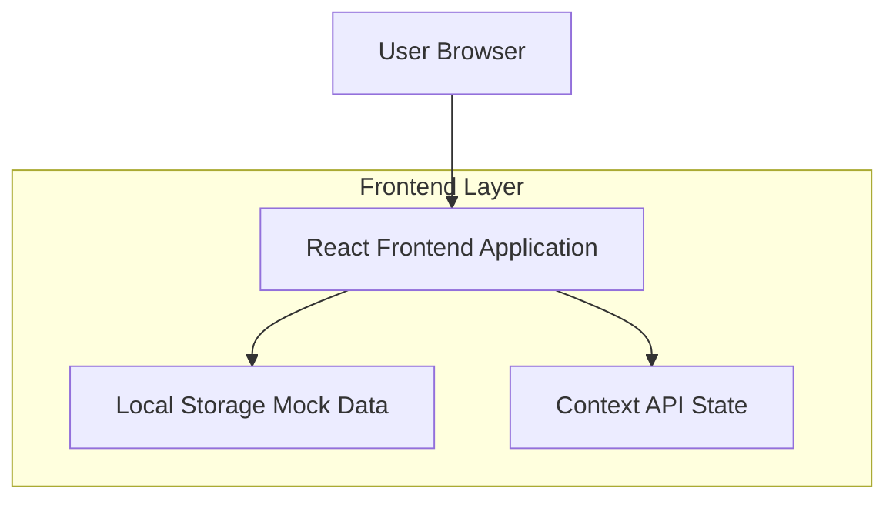
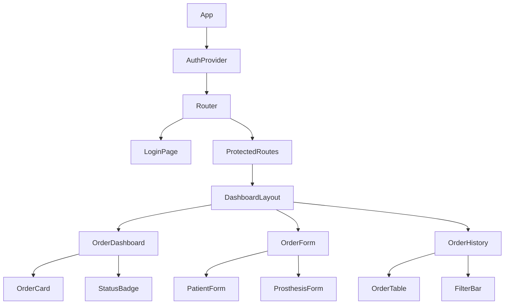

## 1. Architecture design



## 2. Technology Description

- **Frontend**: React@18 + tailwindcss@3 + vite
- **Initialization Tool**: vite-init
- **UI Components**: shadcn/ui + lucide-react
- **State Management**: React Context API + useReducer
- **Routing**: React Router DOM@6
- **Backend**: None (aplicación frontend únicamente)
- **Data Storage**: LocalStorage + Context API (mock data)

## 3. Route definitions

| Route | Purpose |
|-------|---------|
| /login | Página de autenticación para dentistas y administradores |
| /dashboard | Dashboard principal con lista de pedidos según rol |
| /orders/new | Formulario de creación de nuevo pedido |
| /orders/history | Historial completo de pedidos con filtros |
| /orders/:id | Vista detallada de un pedido específico |
| / | Redirección a /login (ruta raíz) |

## 4. Core Components Structure

### 4.1 Authentication Flow
```typescript
interface AuthContextType {
  user: User | null;
  login: (username: string, password: string) => Promise<boolean>;
  logout: () => void;
  isAuthenticated: boolean;
  userRole: 'dentista' | 'admin' | null;
}

interface User {
  id: string;
  username: string;
  role: 'dentista' | 'admin';
  name: string;
}
```

### 4.2 Order Data Structure
```typescript
interface Order {
  id: string;
  patientName: string;
  prosthesisType: 'corona' | 'puente' | 'dentadura' | 'ortodoncia';
  material: 'ceramica' | 'metal' | 'resina' | 'zirconia';
  specifications: string;
  deliveryDate: string;
  status: 'pendiente' | 'en_proceso' | 'completado' | 'entregado';
  dentistId: string;
  dentistName: string;
  createdAt: string;
  notes: string;
  priority: 'normal' | 'urgente';
}
```

### 4.3 Mock Data Service
```typescript
class MockDataService {
  static initializeData(): void;
  static getOrders(userRole: string, userId?: string): Order[];
  static createOrder(order: Omit<Order, 'id' | 'createdAt'>): Order;
  static updateOrderStatus(orderId: string, status: OrderStatus): void;
  static getOrderById(orderId: string): Order | null;
}
```

## 5. Component Architecture



## 6. State Management Pattern

### 6.1 Order Context
```typescript
interface OrderState {
  orders: Order[];
  loading: boolean;
  error: string | null;
  filters: {
    status?: OrderStatus;
    dateRange?: { start: Date; end: Date };
    searchTerm?: string;
  };
}

type OrderAction = 
  | { type: 'SET_ORDERS'; payload: Order[] }
  | { type: 'ADD_ORDER'; payload: Order }
  | { type: 'UPDATE_ORDER_STATUS'; payload: { orderId: string; status: OrderStatus } }
  | { type: 'SET_FILTERS'; payload: Partial<OrderState['filters']> }
  | { type: 'SET_LOADING'; payload: boolean }
  | { type: 'SET_ERROR'; payload: string | null };
```

### 6.2 Local Storage Keys
- `dp_orders`: Array de pedidos
- `dp_auth`: Datos de sesión del usuario
- `dp_filters`: Filtros persistidos del usuario

## 7. UI Component Structure

### 7.1 shadcn/ui Components Utilizados
- Button, Input, Label, Card, Badge
- Table, Dialog, Select, DatePicker
- Toast (para notificaciones)
- Form (con validación integrada)

### 7.2 Custom Components
```
src/
├── components/
│   ├── auth/
│   │   ├── LoginForm.tsx
│   │   └── ProtectedRoute.tsx
│   ├── orders/
│   │   ├── OrderCard.tsx
│   │   ├── OrderTable.tsx
│   │   ├── OrderForm.tsx
│   │   └── StatusBadge.tsx
│   ├── layout/
│   │   ├── DashboardLayout.tsx
│   │   ├── Header.tsx
│   │   └── Sidebar.tsx
│   └── ui/
│       └── (shadcn components)
├── contexts/
│   ├── AuthContext.tsx
│   └── OrderContext.tsx
├── services/
│   └── MockDataService.ts
└── types/
    └── index.ts
```

## 8. Mock Authentication Logic

```typescript
const mockUsers = [
  { id: '1', username: 'dentista', password: 'demo123', role: 'dentista', name: 'Dr. García' },
  { id: '2', username: 'admin', password: 'admin123', role: 'admin', name: 'Admin Sistema' }
];

// Validación simple sin hashing para PoC
const validateCredentials = (username: string, password: string): User | null => {
  const user = mockUsers.find(u => u.username === username && u.password === password);
  return user ? { id: user.id, username: user.username, role: user.role, name: user.name } : null;
};
```

## 9. Data Persistence Strategy

- **Inicialización**: Carga datos mock al primer acceso
- **Guardado automático**: Persiste cambios en LocalStorage
- **Backup**: Exportar/importar datos en JSON
- **Reset**: Función para limpiar todos los datos

## 10. Development Considerations

- No se requiere backend ni base de datos
- Tailwind CSS para estilos rápidos y consistentes
- shadcn/ui para componentes profesionales
- TypeScript para type safety
- Vite para desarrollo rápido y build optimizado
- React Router para SPA routing
- Context API suficiente para estado de Po